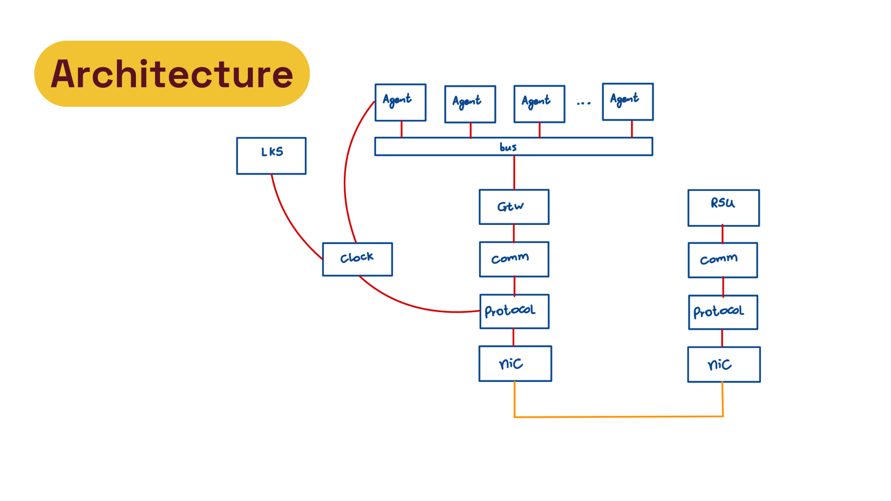

# Communication Library for Autonomous Systems

Reliable, secure and time-synchronised data exchange for autonomous vehicles—both **inside a vehicle** (threads in one process) and **between vehicles** (raw-Ethernet broadcast).

| Stage | Core Feature | 
|-------|--------------|
| P1 | Raw-socket Ethernet stack (`SocketEngine`, `NIC`, `Protocol`, `Communicator`) | 
| P2 | Shared-memory / in-process routing | 
| P3 | Time-triggered publish–subscribe (Interest/Response) | 
| P4 | PTP-based clock sync + message MAC authentication | 
| P5 | Virtual collision domains & RSU key exchange | 
| P6 | Performance optimisations | 
| P7 | Integration with real world data | 

---

## 1. High-Level Architecture



* **Intra-vehicle** messages are sent by the `Agent` to the `CAN BUS` and routed to the other `Agents`.
* **Inter-vehicle** messages are sent by the `Agent` to the `CAN BUS`, routed to the `Gateway` where they go down the stack and are broadcasted.
* Dual Observer patterns decouple layers and provide thread-safe delivery.

---

## 2. Repository Layout

| Path | Contents |
|------|----------|
| `include/` | Public headers (framework, network, utilities, components) |
| `doc/` | Design docs, UML, sequence diagrams, implementation plans |
| `tests/` | Unit, integration and system tests (dummy interface `test-dummy0`) |
| `tools/` | Analysis & helper scripts (latency, threads, trajectories) |
| `config/` | Dockerfile, Doxygen config, map configs |

---

## 3. Build & Test

```bash
# Build library and run ALL tests (unit → integration → system)
make
```

The build creates a dummy network interface; real interfaces remain untouched.

---

## 4. Documentation & Slides

* 🌐 **Online API docs** (GitHub Pages) — auto-generated Doxygen:  
  https://joaopedroschmidtcordeiro.github.io/UFSC-INE5424/
* 📚 **System architecture & implementation details**: [`doc/README.md`](doc/README.md)
* 📚 **Test environment**: [`tests/README.md`](tests/README.md)
* 🎞️ **Stage slides**: [`doc/slides.md`](doc/slides.md)
* 🏠 **Project root overview**: this file.

---

## Acknowledgements

Created for the Operating Systems II course (INE5424) at UFSC.

---

## License

MIT © 2025 César Augusto Pereira de souza, Enzo Nicolás Spotorno Bieger, João Pedro Perez Resmer & João Pedro Schmidt Cordeiro