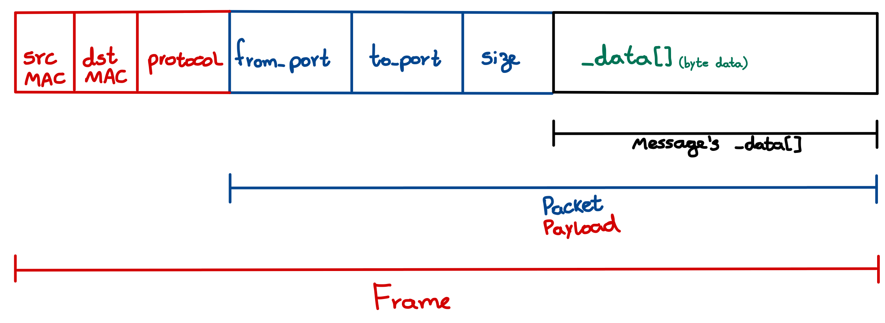

# Communication Library for Autonomous Systems

This project implements a reliable and secure communication library for autonomous systems, focusing on the communication between vehicles and their components.

## Project Description

The project follows the specifications provided by the Operating Systems II course, implementing:

1. **Communication Stack**:
   - Network Interface Card (NIC) simulation
   - Protocol layer for message routing
   - Communicator class for high-level message exchange

2. **Observer Pattern Implementation**:
   - Dual observer pattern approach as specified by the professor
   - Conditional Observer pattern between NIC and Protocol for filtering
   - Concurrent Observer pattern between Protocol and Communicator for asynchronous communication

3. **Process Management**:
   - Each vehicle runs in its own process
   - Initializer framework for managing vehicle lifecycle
   - Inter-process communication through the communication stack

4. **Vehicle Component Architecture**:
   - Component base class for vehicle subsystems
   - Specialized components for various vehicle functions
   - Thread-safe communication between components

## Project Structure

```
project-root/
│── include/              # Header files
│   ├── communicator.h    # High-level communication API
│   ├── initializer.h     # Process management
│   ├── nic.h             # Network interface implementation
│   ├── observed.h        # Observer pattern implementation
│   ├── observer.h        # Observer pattern implementation
│   ├── protocol.h        # Communication protocol
│   ├── vehicle.h         # Vehicle implementation
│   ├── component.h       # Base class for vehicle components
│   ├── address.h         # Address handling
│   ├── ethernet.h        # Ethernet frame handling
│   ├── socketEngine.h    # Raw socket communication
│   ├── sharedMemoryEngine.h # Shared memory communication
│   ├── message.h         # Message container
│   ├── buffer.h          # Memory management
│   ├── components/       # Specialized vehicle components
│       ├── battery_component.h
│       ├── camera_component.h
│       ├── ecu_component.h
│       ├── ins_component.h
│       ├── lidar_component.h
│── tests/                # Test implementations
│   ├── unit_tests/       # Unit tests for individual components
│   ├── integration_tests/ # Tests for component interactions
│   ├── system_tests/     # Full system tests
│── bin/                  # Compiled binaries
│── build/                # Build artifacts
│── doc/                  # Documentation
│   ├── README.md         # System architecture overview
│   ├── README_tests.md   # Testing framework documentation
│   ├── classes/          # Component-specific documentation
│       ├── README-Communicator.md
│       ├── README-Initializer.md
│       ├── README-Observer.md
│       ├── README-Protocol.md
│       ├── README-Nic.md
│       ├── README-Ethernet.md
│       ├── README-SocketEngine.md
│       ├── README-SharedMemoryEngine.md
│       ├── README-Message.md
│       ├── README-Buffer.md
│── logs/                 # Log output directory
│── statistics/           # Performance metrics and statistics
│── Makefile              # Build and test automation
│── Dockerfile            # Container definition for testing
│── README.md             # Project overview
```

## Getting Started

### Prerequisites

- C++14 compatible compiler
- POSIX-compatible environment
- pthread library

### Building and Running Tests

```bash
# Build and run tests
make 

# Clean build artifacts
make clean
```

### Demo Test Configuration

The main demo test simulates a network of autonomous vehicles:
- Creates multiple vehicles running in separate processes
- Each vehicle has various components (LiDAR, camera, ECU, etc.)
- Components communicate with each other within and across vehicles
- All log output is saved to the logs/ directory

## System Architecture

The complete system architecture and detailed component interactions are documented in [doc/README.md](doc/README.md). This document provides:

- A layered architecture diagram of the communication system
- Explanation of the Observer pattern implementations
- Detailed documentation for each component
- Information about communication flow and message handling
- Memory management and thread safety details

## Component Architecture

The component architecture consists of:

1. **Base Component Class**:
   - Thread-safe execution in dedicated threads
   - Standardized communication interface
   - Built-in logging and error handling

2. **Specialized Components**:
   - **LiDAR Component**: Generates and transmits point cloud data
   - **Camera Component**: Simulates video frame capture and transmission
   - **ECU Component**: Electronic Control Unit for vehicle management
   - **INS Component**: Inertial Navigation System for position tracking
   - **Battery Component**: Battery status monitoring and reporting

3. **Component Communication**:
   - Direct component-to-component messaging
   - Support for broadcast communications
   - Addressing based on vehicle ID and component port

## Documentation

For detailed information about each component, please refer to the following documentation:

- **doc/README.md**: Overview of the entire communication system architecture
- **doc/README_tests.md**: Details about the testing framework
- **doc/classes/README-Communicator.md**: Details of the Communicator class implementation
- **doc/classes/README-Initializer.md**: Process management and vehicle lifecycle
- **doc/classes/README-Observer.md**: Observer pattern implementation details
- **doc/classes/README-Protocol.md**: Communication protocol implementation
- **doc/classes/README-Nic.md**: Network interface card implementation
- **doc/classes/README-Ethernet.md**: Ethernet frame handling
- **doc/classes/README-SocketEngine.md**: Low-level network access with raw sockets
- **doc/classes/README-SharedMemoryEngine.md**: Shared memory communication engine
- **doc/classes/README-Message.md**: Message container implementation
- **doc/classes/README-Buffer.md**: Memory management for network data

## Implementation Notes

This project implements a dual observer pattern approach:

1. **Conditional Observer Pattern**:
   - Used between NIC and Protocol
   - Based on protocol numbers for filtering
   - No thread synchronization involved

2. **Concurrent Observer Pattern**:
   - Used between Protocol and Communicator
   - Provides asynchronous message handling
   - Includes thread synchronization with semaphores

The implementation follows the professor's specifications, providing a robust foundation for communication between autonomous systems.

## Address Rule of Formation

Each Communicator in the system is assigned a unique address that follows a hierarchical addressing scheme:

1. **Physical Address Component (MAC Address)**:
   - Each Communicator inherits the physical MAC address of the vehicle's NIC
   - MAC addresses are 6-byte (48-bit) identifiers defined in `Ethernet::Address`

2. **Logical Address Component (Port Number)**:
   - Each Communicator within a vehicle is assigned a unique port number
   - Port 0 is reserved for the vehicle itself
   - Components are assigned sequential ports (1, 2, 3, etc.)

3. **Vehicle MAC Address Formation**:
   - Vehicle MAC addresses follow a specific format: `02:00:00:00:XX:YY`
   - The first byte is always `0x02` to indicate a locally administered address
   - The last two bytes `XX:YY` represent the 16-bit vehicle ID
   - This design limits the system to a maximum of 65,536 (2^16) unique vehicles

4. **String Representation**:
   - Addresses are formatted as `MAC:PORT` 
   - Example: `02:00:00:00:00:01:1` represents the component with port 1 on a vehicle with MAC address 02:00:00:00:00:01

This dual-layer addressing system ensures unique identification of each Communicator across the entire network.

## Multicast Capability

The hierarchical addressing scheme supports potential implementation of multicast communication:

1. **Component Groups**:
   - Components can be logically grouped by assigning similar port patterns
   - For example, all sensor components could use ports 1xx, actuators 2xx, etc.

2. **Vehicle Groups**:
   - Vehicles can be organized into functional groups using specific bits in their ID
   - Example: First 8 bits could represent the group, last 8 bits the vehicle within the group

3. **Multicast Implementation**:
   - Protocol layer can be extended to recognize special address patterns for multicast
   - Messages could be sent to all components of a certain type across multiple vehicles
   - A multicast address could use reserved patterns (e.g., specific port ranges or MAC address bits)

This addressing structure provides the flexibility to implement efficient one-to-many communication patterns in future extensions.

## Encapsulation Hierarchy

```
Application Layer:
└── Message<MaxSize>
    ├── _data[] (actual application data)
    ├── _size (data size)
    └── _origin (source address)
    
Transport Layer (Protocol):
└── Protocol::Packet
    ├── Header (from_port, to_port, size)
    └── Data[] (contains Message's _data)
    
Network Layer (Ethernet):
└── DataBuffer
    └── Ethernet::Frame
        ├── Header (src MAC, dst MAC, protocol)
        └── payload[] (contains Protocol::Packet)
```

### Illustration of the Encapsulation



## Clock Synchronization

The system implements a high-precision PTP (Precision Time Protocol) clock synchronization mechanism designed for autonomous vehicle networks. The clock synchronization parameters have been carefully chosen based on precision requirements and hardware capabilities.

### Design Rationale

#### **Precision Choice: Microsecond Resolution**
The system uses microsecond precision (`std::chrono::microseconds`) for all timestamp operations:

- **Message transmission time**: 2μs per message
- **Hardware capability**: macOS M1 Pro reliably delivers microsecond precision (verified through testing)
- **PTP requirements**: Microsecond precision meets IEEE 1588 standards for vehicular applications
- **Efficiency**: Optimal balance between precision and computational overhead

#### **Timeout Configuration: 500ms Leader Silence Interval**
The `MAX_LEADER_SILENCE_INTERVAL` is set to 500 milliseconds based on cumulative error analysis:

```cpp
// Allow up to 10μs cumulative error:
// For high-precision oscillator (~20 ppb): 10μs / 20ppb = 500ms
static constexpr DurationType MAX_LEADER_SILENCE_INTERVAL = std::chrono::milliseconds(500);
```

**Calculation methodology**:
- **Cumulative error limit**: 10μs (10× the 1μs precision for safety margin)
- **Assumed oscillator drift**: 20 parts per billion (ppb)
- **Formula**: `MAX_SILENCE = ERROR_LIMIT / DRIFT_RATE = 10μs / 20ppb = 500ms`

#### **Hardware Requirements**
This configuration assumes high-precision oscillators:
- **OCXO (Oven Controlled Crystal Oscillator)**: Typical 1-100 ppb stability
- **GPS-disciplined oscillators**: Sub-ppb long-term stability
- **High-quality TCXO**: 0.1-10 ppm (acceptable with shorter timeouts)

#### **Benefits of This Approach**

1. **Network robustness**: 500ms timeout tolerates network jitter and temporary delays
2. **Precision maintenance**: Cumulative drift error stays well within acceptable bounds
3. **False positive prevention**: Long timeout reduces unnecessary leader failovers
4. **Scalability**: Supports large vehicle networks with varying message frequencies

#### **Performance Characteristics**
- **Maximum drift error**: 10μs over 500ms silence period
- **Network tolerance**: Handles typical automotive network delays (1-100ms)
- **Leader failover time**: Maximum 500ms detection of failed leaders
- **Message capacity**: ~250,000 messages possible during timeout period (500ms ÷ 2μs)

This design ensures reliable clock synchronization while maintaining the precision required for safety-critical autonomous vehicle operations.

## Docker to use most recent gcc version

```bash
sudo docker build -t newestGCCenv .
sudo docker run -it --rm --privileged -v "$(pwd)":/app newestGCCenv
```