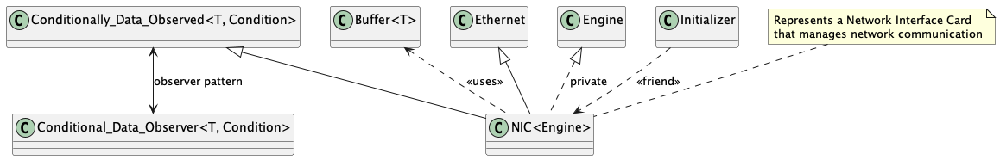

# Network Interface Card (NIC) Implementation

## Overview

This document describes the implementation of the Network Interface Card (NIC) class, which serves as the foundation for network communication in the system. The NIC implementation provides a template-based, thread-safe interface for handling Ethernet frames, managing network buffers, and coordinating with higher-level protocols through the Observer pattern.

## Files and Their Purpose

1. **nic.h**:
   - Defines the NIC template class
   - Implements buffer management and network operations
   - Provides statistics tracking for network operations
   - Integrates with the Observer pattern for protocol notification

## Class Relationships

The NIC implementation consists of several related classes and interfaces:



## NIC Implementation Details

### Template Structure

The NIC class is implemented as a template that takes an Engine type parameter:

```cpp
template <typename Engine>
class NIC: public Ethernet, 
          public Conditionally_Data_Observed<Buffer<Ethernet::Frame>, Ethernet::Protocol>, 
          private Engine
```

This structure provides:
1. Ethernet interface implementation
2. Observer pattern support for protocol notification
3. Engine-specific network operations

### Key Components

1. **Buffer Management**:
   - Fixed-size buffer pool for send and receive operations
   - Thread-safe buffer allocation and deallocation
   - Semaphore-based buffer availability tracking

2. **Network Operations**:
   - Send and receive operations for Ethernet frames
   - Address management for source and destination
   - Protocol number handling for frame routing

3. **Statistics Tracking**:
   - Packet counts (sent/received)
   - Byte counts (sent/received)
   - Drop counts (transmit/receive)

### Buffer Management System

The NIC class implements a sophisticated buffer management system:

1. **Buffer Pool**:
   ```cpp
   static const unsigned int BUFFER_SIZE = Traits<NIC<Engine>>::SEND_BUFFERS * sizeof(Buffer<Ethernet::Frame>) + 
                                         Traits<NIC<Engine>>::RECEIVE_BUFFERS * sizeof(Buffer<Ethernet::Frame>);
   static const unsigned int N_BUFFERS = Traits<NIC<Engine>>::SEND_BUFFERS + Traits<NIC<Engine>>::RECEIVE_BUFFERS;
   ```

2. **Buffer Operations**:
   - `alloc()`: Allocates a buffer for sending
   - `free()`: Releases a buffer back to the pool
   - `receive()`: Processes received data into a buffer

3. **Thread Safety**:
   - Uses semaphores for buffer availability
   - Mutex protection for buffer queue operations
   - Atomic operations for statistics tracking

### Observer Pattern Integration

The NIC class extends `Conditionally_Data_Observed` to support protocol-based notification:

1. **Type Definitions**:
   ```cpp
   typedef Ethernet::Address Address;
   typedef Ethernet::Protocol Protocol_Number;
   typedef Buffer<Ethernet::Frame> DataBuffer;
   typedef Conditional_Data_Observer<DataBuffer, Protocol_Number> Observer;
   ```

2. **Notification Flow**:
   - Receives frames from the network
   - Allocates buffers for received data
   - Notifies observers based on protocol number
   - Manages buffer lifecycle through reference counting

## Alignment with Project Requirements

The NIC implementation aligns with the project specifications:

1. **Template-Based Design**:
   - Follows the specified template structure
   - Supports different Engine implementations
   - Maintains proper inheritance relationships

2. **Buffer Management**:
   - Implements the required buffer pool
   - Provides thread-safe buffer operations
   - Manages buffer lifecycle correctly

3. **Network Operations**:
   - Supports Ethernet frame handling
   - Implements proper addressing
   - Provides statistics tracking

4. **Observer Pattern**:
   - Extends Conditionally_Data_Observed
   - Supports protocol-based notification
   - Maintains proper observer relationships

## Usage Example

```cpp
// Create a NIC instance with SocketEngine
NIC<SocketEngine> nic;

// Set the NIC's address
Ethernet::Address addr = {0x00, 0x11, 0x22, 0x33, 0x44, 0x55};
nic.setAddress(addr);

// Allocate a buffer for sending
Ethernet::Address dst = {0x66, 0x77, 0x88, 0x99, 0xAA, 0xBB};
Ethernet::Protocol prot = 0x0800; // IPv4
unsigned int size = 1500;
auto buffer = nic.alloc(dst, prot, size);

// Fill the buffer with data
// ... fill buffer data ...

// Send the buffer
nic.send(buffer);

// Receive data
Ethernet::Address src, dst;
void* data = malloc(1500);
unsigned int received = nic.receive(buffer, &src, &dst, data, 1500);

// Process received data
// ... process data ...

// Free resources
free(data);
```

## Conclusion

The NIC implementation provides a robust foundation for network communication in the system. Its template-based design allows for flexibility in the underlying network engine while maintaining a consistent interface for higher-level components. The implementation successfully integrates buffer management, network operations, and the Observer pattern to create a thread-safe, efficient network interface.

The NIC class serves as a critical component in the communication stack, bridging the gap between the physical network layer and the protocol layer. Its design follows the project requirements closely while providing the necessary functionality for reliable network communication. The implementation's focus on thread safety and resource management ensures it can operate effectively in a concurrent environment.
