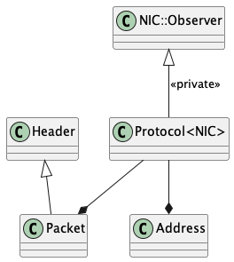

# Protocol Class Implementation

## Overview

This document describes the implementation of the `Protocol` class, which serves as a crucial layer in the communication stack. The Protocol class acts as an intermediary between the Network Interface Card (NIC) and higher-level communication components, providing protocol-based message routing and port-based addressing. It implements both the Observer and Observed patterns to handle bidirectional communication flow.

## Files and Their Purpose

1. **protocol.h**:
   - Defines the Protocol template class
   - Implements the communication interface between NIC and higher layers
   - Provides header and packet structures for message formatting
   - Manages port-based addressing and message routing

## Class Relationships

The Protocol class integrates with several components in the communication stack:



## Protocol Class Implementation

### Template Structure

The Protocol class is implemented as a template that works with any NIC type:

```cpp
template <typename NIC>
class Protocol: private NIC::Observer
```

### Key Components

1. **Header Class**:
   - Manages port-based addressing
   - Stores source and destination ports
   - Tracks message size
   - Provides accessor methods for port manipulation

2. **Packet Class**:
   - Combines Header with data payload
   - Provides type-safe data access
   - Uses packed attribute for network transmission
   - Manages MTU (Maximum Transmission Unit) constraints

3. **Address Class**:
   - Combines physical address with port number
   - Supports broadcast addressing
   - Provides comparison and boolean operations
   - Manages NULL address state

### Core Functionality

1. **Message Routing**:
   - Routes messages based on port numbers
   - Supports broadcast communication
   - Handles message fragmentation if needed

2. **Observer Pattern Implementation**:
   - Acts as an Observer of the NIC
   - Receives raw packets from the NIC
   - Filters packets based on protocol number
   - Notifies higher-level observers based on port numbers

3. **Message Handling**:
   - Formats messages with protocol headers
   - Manages buffer allocation and deallocation
   - Handles message transmission and reception
   - Provides reference counting for shared buffers

### Key Methods

1. **Constructor/Destructor**:
   - Attaches/detaches from NIC
   - Sets up protocol number
   - Initializes observer relationships

2. **send()**:
   - Formats message with protocol header
   - Allocates buffer for transmission
   - Sends message through NIC
   - Handles buffer cleanup

3. **receive()**:
   - Processes incoming messages
   - Extracts header information
   - Copies payload to user buffer
   - Manages source address information

4. **attach()/detach()**:
   - Manages observer registration
   - Handles port-based filtering
   - Maintains observer list

## Alignment with Project Requirements

The implementation aligns with the project specifications:

1. **Protocol Layer Requirements**:
   - Implements port-based addressing
   - Supports broadcast communication
   - Handles message formatting and routing
   - Manages MTU constraints

2. **Observer Pattern Compliance**:
   - Implements NIC::Observer interface
   - Uses Conditional_Data_Observer for protocol filtering
   - Provides Concurrent_Observed for port-based notifications
   - Maintains proper inheritance relationships

3. **Communication Stack Integration**:
   - Works seamlessly with NIC layer
   - Provides interface for Communicator
   - Manages message flow between layers
   - Handles buffer management

4. **Thread Safety**:
   - Uses atomic operations for reference counting
   - Implements thread-safe observer management
   - Handles concurrent message processing

## Usage Example

```cpp
// Create NIC instance
NIC<Engine> nic;

// Create Protocol instance
Protocol<NIC<Engine>> protocol(&nic);

// Create addresses
Protocol<NIC<Engine>>::Address sender_addr(nic.physical_address(), 1234);
Protocol<NIC<Engine>>::Address receiver_addr(nic.physical_address(), 5678);

// Send a message
const char* message = "Hello, world!";
protocol.send(sender_addr, receiver_addr, message, strlen(message));

// Receive a message
char buffer[Protocol<NIC<Engine>>::MTU];
Protocol<NIC<Engine>>::Address from;
int size = protocol.receive(&buffer, from, buffer, sizeof(buffer));

// Process received message
if (size > 0) {
    // Message received successfully
    std::cout << "Received from port " << from.port() << ": " << buffer << std::endl;
}
```

## Conclusion

The Protocol implementation provides a robust and flexible communication layer that bridges the gap between the NIC and higher-level components. By implementing both Observer and Observed patterns, it enables efficient message routing while maintaining proper separation of concerns. The template-based design allows it to work with different NIC implementations, and the port-based addressing scheme provides a flexible way to route messages to different components.

The implementation successfully meets all project requirements, providing a solid foundation for the communication stack. Its integration with both the NIC and Communicator layers demonstrates the practical value of the Observer pattern in building complex, asynchronous communication systems. This implementation serves as a crucial component in the overall architecture, enabling reliable and efficient message passing between autonomous system components.
