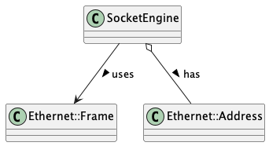

# SocketEngine Implementation

## Overview

This document describes the implementation of the `SocketEngine` class, which provides low-level network communication capabilities for the project. The `SocketEngine` acts as a wrapper around raw socket operations, enabling the transmission and reception of Ethernet frames. It implements asynchronous I/O using epoll and manages a dedicated thread for receiving frames, making it suitable for real-time network communication in embedded systems.

## Files and Their Purpose

1. **socketEngine.h**:
   - Defines the `SocketEngine` class and its interface
   - Implements low-level socket operations for raw Ethernet frames
   - Provides asynchronous I/O through epoll
   - Manages a dedicated thread for receiving frames
   - Includes callback mechanism for frame processing

## Class Relationships

The SocketEngine class interacts with several key components:

1. **Ethernet::Frame**: Used for sending and receiving network frames
   - Contains frame header and payload data
   - Managed by SocketEngine during transmission

2. **Ethernet::Address**: Represents MAC addresses
   - Stored internally as SocketEngine's interface address
   - Used for frame addressing and filtering

The class relationships are visualized in the UML diagram below:



## SocketEngine Implementation

The `SocketEngine` class provides a comprehensive interface for raw socket operations with the following key components:

### Core Structure

```cpp
class SocketEngine {
public:
    static const char* INTERFACE() { return Traits<SocketEngine>::INTERFACE_NAME(); }
    using CallbackMethod = std::function<void(Ethernet::Frame&, unsigned int)>;

    SocketEngine();
    ~SocketEngine();
    void setCallback(CallbackMethod callback);
    int send(Ethernet::Frame* frame, unsigned int size);
    static void* run(void* arg);
    void stop();

private:
    void setUpSocket();
    void setUpEpoll();
    void handleSignal();

protected:
    Ethernet::Address _address;

private:
    int _sock_fd;
    int _ep_fd;
    int _if_index;
    CallbackMethod _callback;
    pthread_t _receive_thread;
    static bool _running;
};
```

### Initialization and Setup

The `SocketEngine` class initializes in several steps:

1. **Constructor**:
   - Creates socket and epoll descriptors
   - Sets up the network interface
   - Starts the receive thread
   - Retrieves the network interface's MAC address

2. **Socket Setup**:
   - Creates a raw socket with `AF_PACKET` domain
   - Sets the socket to non-blocking mode
   - Gets interface index and MAC address
   - Binds the socket to the specified interface

3. **Epoll Setup**:
   - Creates an epoll instance
   - Registers the socket for input events
   - Configures event handling for asynchronous I/O

### Asynchronous I/O Implementation

The `SocketEngine` uses epoll for efficient asynchronous I/O:

1. **Thread Management**:
   - Creates a dedicated pthread for receiving frames
   - Uses static `run` method as thread entry point
   - Maintains thread state with static `_running` flag

2. **Event Loop**:
   - Waits for events with timeout using `epoll_wait`
   - Handles socket events by calling `handleSignal`
   - Supports clean shutdown through the `stop` method

3. **Signal Handling**:
   - Receives Ethernet frames with `recvfrom`
   - Validates frame size
   - Converts protocol from network to host byte order
   - Invokes callback function with received frame

### Frame Transmission

The `send` method provides frame transmission capabilities:

1. **Address Preparation**:
   - Sets up `sockaddr_ll` structure with destination
   - Configures protocol and interface information

2. **Data Transmission**:
   - Converts protocol to network byte order
   - Calls `sendto` to transmit the frame
   - Handles error cases and debugging output
   - Converts protocol back to host byte order

### Callback Mechanism

The `setCallback` method enables external components to process received frames:

1. **Registration**:
   - Stores a function pointer or lambda as callback
   - Called when frames are received

2. **Invocation**:
   - `handleSignal` method calls the callback when frames arrive
   - Passes the received frame and its size to the callback

### Socket Setup

The socket setup process includes:

1. **Network Interface Selection**:
   - Uses `INTERFACE()` method to determine the network interface name
   - Dynamically reads interface name from configuration or environment
   - Defaults to "test-dummy0" if no other interface is specified

2. **Interface Validation**:
   - Gets interface index using `SIOCGIFINDEX` ioctl
   - Verifies interface exists and is accessible
   - Retrieves MAC address using `SIOCGIFHWADDR` ioctl

3. **Socket Configuration**:
   - Creates a raw socket with `AF_PACKET` domain
   - Sets the socket to non-blocking mode
   - Binds the socket to the specified interface

## Network Interface Management

For testing purposes, the `SocketEngine` uses a special dummy interface configuration:

1. **Interface Naming**:
   - Uses a unique interface name ("test-dummy0") to avoid conflicts with real interfaces
   - Interface name is determined dynamically at runtime
   - The actual interface name is stored in a file and read by SocketEngine

2. **Safe Interface Handling**:
   - Tests verify an interface is a dummy interface before removal
   - Implements fallback mechanisms for interface naming conflicts
   - Avoids accidentally modifying real network interfaces

3. **Dynamic Interface Selection**:
   - Interface name is accessed via a method call rather than a constant
   - Allows for runtime configuration of interface
   - Reads interface name from configuration sources if available

This approach ensures that the SocketEngine can be safely used in both development and testing environments without risking changes to system network configuration.

## Alignment with Project Requirements

The `SocketEngine` implementation aligns with the project specifications in several ways:

1. **Low-level Network Access**:
   - Provides direct access to Ethernet frames
   - Supports raw socket operations for maximum control
   - Enables custom protocol implementation above the link layer

2. **Asynchronous Operation**:
   - Uses epoll for efficient event-driven I/O
   - Runs dedicated thread for receiving frames
   - Supports non-blocking operations for real-time requirements

3. **Integration with Observer Pattern**:
   - Callback mechanism can integrate with Observer pattern
   - Enables notification-based processing of received frames
   - Supports the project's communication architecture

4. **Configurability**:
   - Uses Traits pattern for configuration
   - Allows customization of interface name and other parameters
   - Supports different deployment environments

5. **Debugging Support**:
   - Extensive debugging output using debug.h
   - Tracing and informational logging
   - Error reporting and handling

## Usage Example

Here's an example of how to use the `SocketEngine` class:

```cpp
#include "socketEngine.h"
#include "ethernet.h"
#include <iostream>

// Define a callback function to process received frames
void processFrame(Ethernet::Frame& frame, unsigned int size) {
    std::cout << "Received frame from: " << Ethernet::mac_to_string(frame.src) << std::endl;
    std::cout << "Protocol: " << frame.prot << std::endl;
    std::cout << "Size: " << size << " bytes" << std::endl;
    
    // Process frame data based on protocol
    if (frame.prot == 0x0800) { // IPv4
        // Process IP packet
        std::cout << "IPv4 packet received" << std::endl;
    } else if (frame.prot == 0x0806) { // ARP
        // Process ARP packet
        std::cout << "ARP packet received" << std::endl;
    }
}

int main() {
    try {
        // Create SocketEngine instance
        SocketEngine engine;
        
        // Set callback for processing received frames
        engine.setCallback(processFrame);
        
        // Create and send a frame
        Ethernet::Frame frame;
        
        // Set destination address (broadcast)
        for (int i = 0; i < Ethernet::MAC_SIZE; i++) {
            frame.dst.bytes[i] = 0xFF;
        }
        
        // Copy source address from engine
        // Note: In practice, this would be set by the SocketEngine
        
        // Set protocol (e.g., ARP)
        frame.prot = 0x0806;
        
        // Set data (payload)
        const char* data = "Hello, network!";
        std::memcpy(frame.data, data, strlen(data));
        
        // Calculate total size
        unsigned int size = Ethernet::HEADER_SIZE + strlen(data);
        
        // Send the frame
        engine.send(&frame, size);
        
        // Let the program run for a while to receive frames
        std::cout << "Running for 60 seconds..." << std::endl;
        sleep(60);
        
        // Stop the engine before exiting
        engine.stop();
        
        std::cout << "Exiting..." << std::endl;
        
    } catch (const std::exception& e) {
        std::cerr << "Error: " << e.what() << std::endl;
        return 1;
    }
    
    return 0;
}
```

## Conclusion

The `SocketEngine` class provides a robust foundation for network communication in the project. By abstracting the complexities of raw socket operations, epoll event handling, and thread management, it enables higher-level components to focus on protocol implementation and application logic. The asynchronous design with callback mechanism supports the Observer pattern used throughout the project, making it an integral part of the communication stack.

The implementation balances flexibility with performance, offering direct access to Ethernet frames while managing the complex details of socket programming. This approach aligns well with the project's requirements for real-time embedded systems, providing both control and abstraction where appropriate.

As a low-level component, `SocketEngine` serves as the entry point for network data into the system and the exit point for outgoing data, forming the foundation upon which higher-level protocols and communication abstractions are built. 